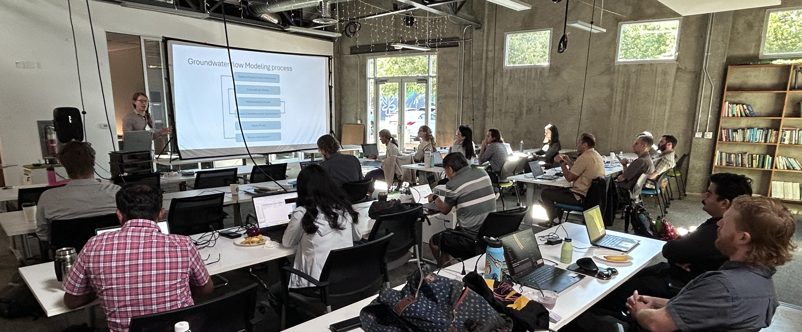

# CWEMF Advanced MODFLOW 6
Advanced Groundwater Modeling with MODFLOW 6
Sacramento, CA  
September 15 - 17, 2026 

## Location
* Classroom: Woodard and Curran, Sacramento: 801 T St, Sacramento, CA 95811

## Course Description
This class will cover many of the advanced MODFLOW 6 capabilities. Most of the class will be taught using Flopy and 
Jupyter Notebooks.  In addition to lectures, most sessions will include in-class exercises to give attendees a better 
understanding of how to use the modeling tools.

The following topics will be covered during the short course
* Getting started with MODFLOW 6 and FloPy
* Mesh generation with FloPy
* Advanced packages (Multi-Aquifer Well, Streamflow Routing, Lake, Unsaturated Zone Flow, Water Mover, and Compaction and SUBsidence)
* Coupling models using exchanges
* Solute and heat transport
* Particle tracking with MODFLOW 6
* Variable density flow
* XT3D multi-point flux approximation for modeling aquifers with full three-dimensional anisotropy
* Parallel MODFLOW 6 simulations
* MODFLOW Application Programming Interface (API) for coupling models, creating custom MODFLOW packages, and controlling MODFLOW during a simulation
* Exporting models to GIS and three dimensional VTK objects

## Instructors
* Josh Larsen, U.S. Geological Survey, California Water Science Center
* Eric Morway, U.S. Geological Survey, Nevada Water Science Center
* Alden Provost, U.S. Geological Survey, Integrated Modeling and Prediction Division

## Software

We will be using python during the class to build model datasets, run models, and post-process model results. It would 
be good to install the software on your laptop before the class. Software installation instructions for local 
installations are provided in [SOFTWARE.md](./SOFTWARE.md). Contact Josh Larsen (jlarsen@usgs.gov) if you have any 
problems installing the class software.

## Agenda: Tenative, may need further adjustment

The following tentative agenda is based on a start time each morning of 8:30 AM and an ending time each day of 4:30 PM.  
The agenda may be adjusted during the week in response to student requests.

### Tuesday, September 15, 2026

| Time     | Topic                            | Duration, Lead                    |
|----------|----------------------------------|-----------------------------------|
| 8:30 AM  | Introductions and Class Overview | 30 minutes, Larsen/Provost/Morway |
| 9:00 AM  | FloPy refresher                  | 1 hour, Larsen                    |
| 10:00 AM | BREAK                            | 15 minutes                        |
| 10:15 AM | GWF Advanced Packages            | 1 hr 45 minutes, Morway           |
| 12:00 PM | LUNCH                            | 1 hour 15 minutes                 |
| 1:15 PM  | Solute and Heat Transport Part 1 | 1 hour, Provost/Morway            |
| 2:15 PM  | BREAK                            | 15 minutes                        |
| 2:30 PM  | Solute and Heat Transport Part 2 | 2 hours, Provost/Morway           |
| 4:30 PM  | ADJOURN                          |                                   |

### Wednesday, September 16, 2026

|Time       |Topic                             |Duration, Lead                     |
|-----------|----------------------------------|-----------------------------------|
|8:30 AM    |PRT Part 1                        |1 hour 15 minutes, Provost         |
|9:45 AM    |BREAK                             |15 minutes                         |
|10:00 AM   |PRT Part 2                        |1 hour, Provost                    |
|11:00 AM   |XT3D                              |45 minutes, Provost                |
|11:45 AM   |LUNCH                             |1 hour 15 minutes                  |
|1:00 PM    |Buoyancy and Viscosity            |45 minutes, Provost/Morway         |
|1:45 PM    |Multi-Model Coupling              |30 minutes, Morway                 |
|2:15 PM    |BREAK                             |15 minutes                         |
|2:30 PM    |Parallel MODFLOW Part 1           |1 hour, Larsen                     |
|3:30 PM    |BREAK                             |15 minutes                         |
|3:45 PM    |Parallel MODFLOW Part 2           |45 minutes, Larsen                 |
|4:30 PM    |ADJOURN                           |                                   |

### Thursday, September 17, 2026

| Time     | Topic                         | Duration, Lead            |
|----------|-------------------------------|---------------------------|
| 8:30 AM  | CSUB Package                  | 1 hour, Larsen            |
| 9:30 AM  | MODFLOW API Part 1            | 45 minutes, Larsen        |
| 10:15 AM | BREAK                         | 15 minutes                |
| 10:30 AM | MODFLOW API Part 2            | 1 hour 15 minutes, Larsen |
| 11:45 AM | LUNCH                         | 1 hour 15 minutes         |
| 1:00 PM  | Mesh Generation with FloPy    | 1 hour, Larsen            |
| 2:00 PM  | BREAK                         | 15 minutes                |
| 2:30 PM  | ABC Utility                   | 45 minutes, Morway        |
| 3:15 PM  | Advanced Visualization        | 45 minutes, Larsen        |
| 4:00 PM  | Wrap-up/future directions     | 30 minutes, Larsen        |
| 4:30 PM  | ADJOURN                       |                           |
